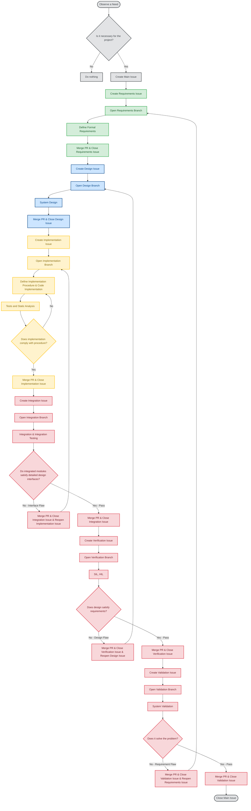

# Contributing & Engineering Methodology

## 1. Core Philosophy: Engineering as Applied Science
At ATOP, we reject ad-hoc hacking and trial-and-error development. Engineering is fundamentally the **scientific method applied to creation**. 

While natural sciences use the scientific method for **Discovery**, engineering uses an isomorphic application of the exact same logical rigor for **Creation**. **Any attempt to bypass, subvert, or break the scientific method within this project will be indefinitely vetoed.** We operate under both formal expressions of the scientific method:

### A. The Scientific Method of Discovery (Understanding Reality)
1. **Observation**: Identifying a physical or operational phenomenon.
2. **Hypothesis**: Proposing a model or explanation for the phenomenon.
3. **Experiment Design**: Setting up controlled conditions to test the model.
4. **Experimentation**: Execution and data gathering.
5. **Data Consistency Verification**: Ensuring experimental data is sound and repeatable.
6. **Hypothesis Validation**: Confirming or refuting the proposed model.
7. **Natural Law / Theory**: Establishing reliable principles.

### B. The Scientific Method of Creation (Engineering & Synthesis)
1. **Requirements (Hypothesis of Need)**: Defining what problem needs to be solved and what functional constraints must be met (e.g., Phase 0/A MDD & URD).
2. **Behavioral Design**: Architecting how the system will behave to satisfy the requirements without violating physical or logical boundaries (SRS & Architecture).
3. **Implementation/Manufacturing Procedure**: Formulating the rigorous, reproducible steps required to build the artifact (coding standards, MISRA-C, Power of 10, build pipelines).
4. **Implementation / Execution**: Fabricating or coding the artifact according to the procedure.
5. **Procedure Conformance**: Confirming that the artifact was built *exactly* as specified by the procedure (static analysis, unit testing).
6. **Behavioral Verification**: Proving that the artifact's actual behavior matches the original requirements (via SITL and HITL testing).
7. **Prototype / Product Validation**: Deploying the verified artifact into its operational plant environment (such as UAV flight validation).

---

## 2. Standards as Guardrails
While the scientific method provides the underlying logic, industrial and aerospace standards (**ECSS**, **MISRA-C**, **NASA Power of 10**) serve as our operational guardrails. They exist to eliminate ambiguity, enforce determinism, and prevent systemic errors before code ever touches silicon.

---

## 3. Repository Workflow Procedure
To maintain the integrity of this methodology, all contributions and changes must follow a rigorous lifecycle mirroring the scientific method of creation:

1. **Issue Tracking**:
   - No change, refactoring, or feature is implemented without a prior formal Issue detailing its rationale and traceability. Branches must explicitly tell their nature (req/..., design/..., feat/..., verify/...).
   - On verification/validation/integration failure, the corresponding upstream Issue is reopened rather than creating a new one, preserving discussion history and traceability.
2. **Documentation-Driven Engineering**:
   - Requirements and design specifications must be updated *before* code implementation.
   - Traceability links must be maintained between requirements and verification artifacts.
4. **Code Quality Gates**:
   - Zero dynamic memory allocation (`malloc` / `heap` usage is strictly prohibited).
   - Full compliance with static analysis rules and coding guidelines.
   - Verification through reproducible testing procedures.
   - **Mandatory Binary Formal Audit**: Every example or reference implementation provided in the repository must undergo and pass a formal binary audit, including static analysis and predictability verification on the target compiled output.
5. **Review & Merge**:
   - No PR can merge into main branch without explicit approval of the system architect, CI/CD validation and required documental traces.
   - Every Pull Request for Implementation, Integration, Verification, or Validation must include the corresponding execution logs, test reports, or traceability matrices as mandatory artifacts before review and merge.
