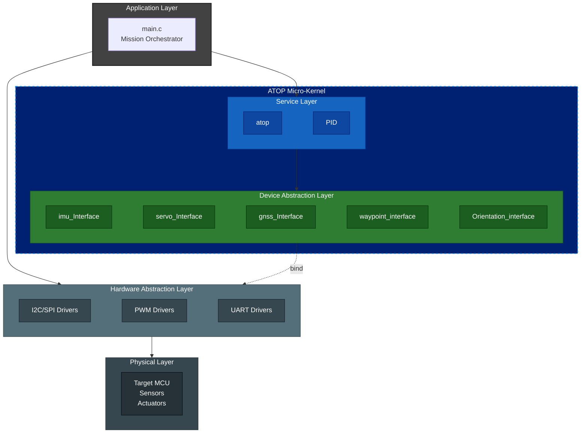
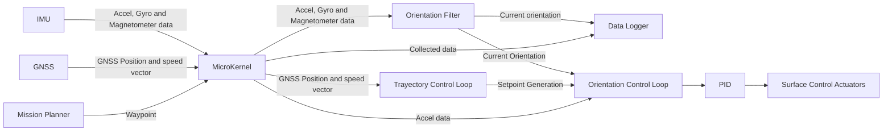

# ATOP: Aeronautic Trajectory and Orientation Processor

An educational, platform-agnostic C Micro-Kernel for UAV flight control systems. Developed as an evolution of a university final project, focusing on clarity, modular design, and flexible hardware abstraction.

## Table of Contents
- [Purpose & Scope](#purpose-&-scope)
- [Features](#features)
- [Architectural Philosophy](#architectural-philosophy)
- [Getting Started](#getting-started)
- [Documentation](#documentation)
- [License](#license)

## Purpose & Scope

This repository represents **Version 2 (v2)** of the control system developed during my Bachelor's Degree Final Project in Industrial and Automatic Electronic Engineering.

*   **v1 (Thesis Project):** A monolithic, baremetal firmware developed for Arduino, focused on validating core flight algorithms. You can review the original work [here](https://addi.ehu.es/handle/10810/53462).
*   **v2 (Current Micro-kernel):** Refactored as a 5-layer agnostic library to solve the hardware-locking issues of v1, allowing for cross-platform deployment and advanced simulation.

## Features

*   **Core Flight Dynamics**: Implements key algorithms for orientation estimation (AHRS) and trajectory stabilization.
*   **Modular Hardware Abstraction Layer (HAL)**: Achieved through function pointers for maximum flexibility and rapid prototyping.
*   **Platform Agnostic**: Easily portable to any system that supports C/C++.
*   **C/C++ Compatibility**: All public headers are wrapped with `extern "C" {}`.

## Architectural Philosophy

### Flexibility vs. Certification Standards

ATOP utilizes a decoupled architecture inspired by modern aerospace frameworks (e.g., NASA’s cFS). By using function pointers for Dependency Injection, we enable high-fidelity Software-In-The-Loop (SITL) testing without code modification.

Safety Standards & MISRA C:2012
While this flexibility requires a formal deviation from MISRA C:2012 (e.g., Rule 11.1), the library implements rigorous mitigation strategies (NULL-pointer validation, redundancy checks, and SEU detection) to ensure reliability. Detailed rationale and compliance matrices can be found in [CODING_STANDARDS.md](./docs/CODING_STANDARDS.md).

## Architecture Layers

*The dashed 'bind' line represents the functional dependency injection. This decoupled interface ensures that the flight-critical logic (ATOP Library) remains bit-identical across different hardware targets and simulation environments.*

## Data Flow Diagram

### Dependency Injection Flow

## Development Roadmap

| Version | Milestone                          | TRL   |
|--------|------------------------------------|-------|
| v0.1.0 | Architectural Baseline             | TRL 3–4 |
| v0.2.0 | Core Flight Logic Implementation   | TRL 4–5 |
| v0.3.0 | SITL Integration                   | TRL 5–6 |
| v0.4.0 | HITL on STM32                      | TRL 6–7 |
| v1.0.0 | Operational Validation (UAV Flight)| TRL 7   |

> ✅ Current phase: Interfaze Implementation (→ v0.1.0)  
> 🎯 Next milestone: Interfaze Implemented (Architecture Baseline)

## Getting Started

### Prerequisites

A C compiler and a target microcontroller environment (e.g., Arduino IDE, STM32CubeIDE) are required.

### Building and Usage

Please refer to the [Build & Deployment Guide](./docs/deployment/build_guide.md) for detailed toolchain setup, MCU porting instructions, and binary reproducibility.

## 📖 Engineering Documentation Portal

A comprehensive suite of documentation following aerospace standards is available in the [docs/](./docs/) directory:
- [Quick Start: Build Guide](./docs/deployment/build_guide.md)
- [Safety & Risk Analysis](./docs/safety/risk_fmea.md)
- [Architecture Overview](./docs/architecture.md)

## License

This project is licensed under the [MIT License](LICENSE).

---
