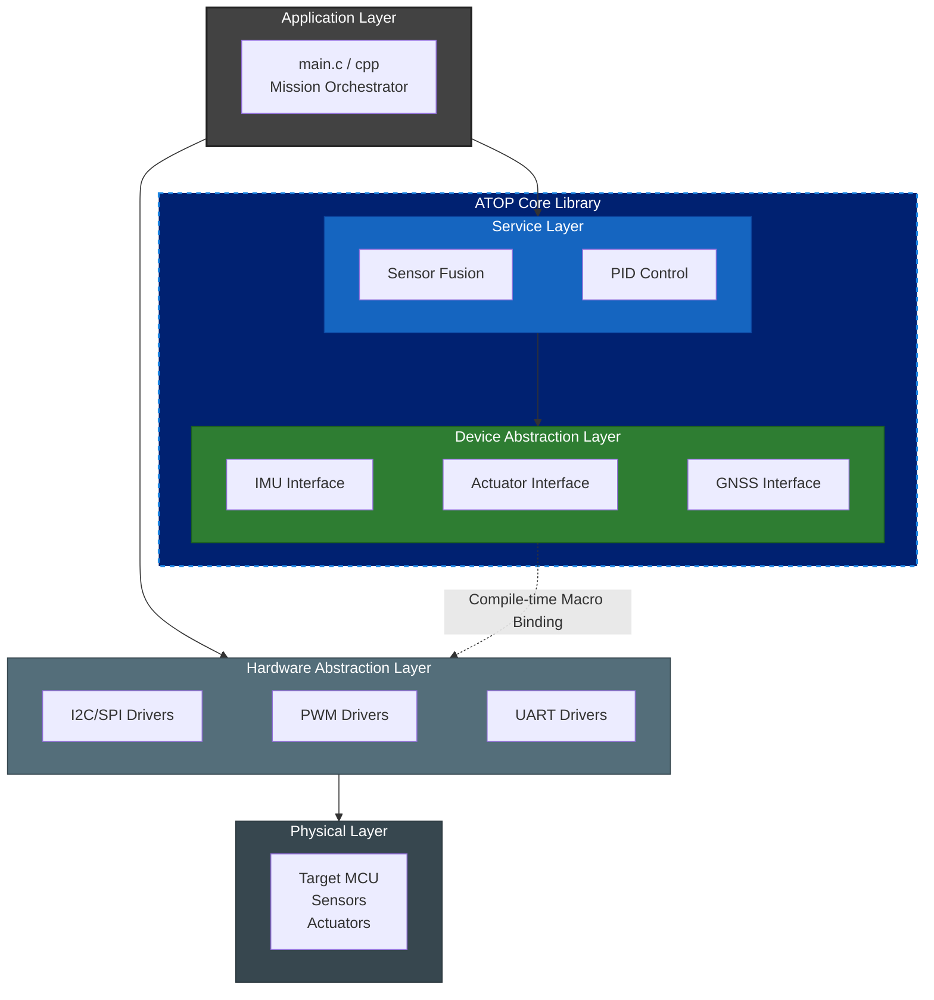
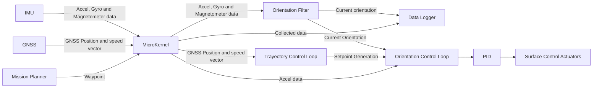

# ATOP: Aeronautic Trajectory and Orientation Processor

A deterministic, hardware-agnostic C firmware library for fixed-wing UAV flight control systems. Developed as an evolution of a university final project, focusing on mathematical rigor, static memory safety, and clean modular architecture following ECSS engineering principles.

> ⚠️ **PROJECT STATUS NOTICE**: This project is currently **paused** while resolving a critical dependency: **`bastard`**, our custom-built code autogenerator designed to ensure formal verification and trace generation for core firmware modules.

## Table of Contents
- [Purpose & Scope](#purpose-&-scope)
- [Core Philosophy](#core-philosophy)
- [Architectural Layers](#architectural-layers)
- [Data Flow & Architecture](#data-flow--architecture)
- [Development Roadmap](#development-roadmap)
- [Documentation & Templates](#documentation--templates)
- [License](#license)

## Purpose & Scope

This repository represents **Version 2 (v2)** of the control system developed during my Bachelor's Degree Final Project in Industrial and Automatic Electronic Engineering.

*   **v1 (Thesis Project):** A monolithic, baremetal firmware developed for Arduino, focused on validating core flight algorithms. You can review the original work [here](https://addi.ehu.es/handle/10810/53462).
*   **v2 (Current Micro-kernel):** Refactored as a decoupled, multi-layer C firmware library to solve the hardware-locking issues of v1, allowing cross-platform deployment on bare-metal targets ranging from 8-bit to 32-bit microcontrollers.

## Core Philosophy

### 1. Hardware Agnosticism via Compile-Time Macro Injection
ATOP decouples numerical processing and control algorithms entirely from physical microcontrollers. Instead of runtime overhead (such as function pointers), integration with the host system is achieved through **compile-time macro dependency injection (HAL/DAL hooks)**, ensuring zero runtime overhead and logical equivalence across target hardware.

### 2. Maximum Criticality & Safety Compliance
Designed for high-reliability embedded environments under strict constraints:
*   **Zero Dynamic Memory Allocation**: Strict prohibition of `malloc`, `calloc`, or equivalent runtime heap allocations to prevent memory fragmentation.
*   **Computational Predictability**: Strictly bounded execution times and determinism.
*   **Coding Standards**: Compliant with **MISRA-C:2012** and NASA's **Power of 10** safety rules.
*   **C/C++ Interoperability**: All public headers are wrapped with `extern "C" {}` for seamless integration into modern C++ host applications.

## Architectural Philosophy

## Architectural Layers

*The dashed link represents compile-time macro dependency injection, decoupling the flight-critical core from silicon-specific drivers.*

## Data Flow Diagram

## Development Roadmap & Status

| Version | Milestone                          | TRL     | Status |
|--------|------------------------------------|---------|--------|
| v0.0.1 | Phase 0/A Requirements Baseline (MDD & URD) | TRL 3   | ✅ **Completed** |
| v0.0.2 | Architectural Design & Software Specs (SRS)| TRL 3–4 | 🔄 **Current Phase** |
| v0.1.0 | Core Flight Firmware Implementation| TRL 4   | ⏳ Pending |
| v0.2.0 | Static Analysis & Code Review (MISRA-C) | TRL 4–5 | ⏳ Pending |
| v0.3.0 | SITL (Software-in-the-Loop) Testing  | TRL 5   | ⏳ Pending |
| v0.4.0 | HITL (Hardware-in-the-Loop) on Target| TRL 6   | ⏳ Pending |
| v1.0.0 | Operational Validation (UAV Flight)| TRL 7   | ⏳ Pending |

## Engineering Documentation (ECSS Baseline)

Formal documentation structured under ECSS standards is located in [docs/](docs/):
- **Mission Concept**: [Mission Description Document (MDD)](docs/requirements/mdd/mdd.md)
- **Requirements Baseline**: [User Requirements Document (URD)](docs/requirements/urd/urd.md)
- **Draft Archive**: Preliminary architectural sketches and legacy PoC code are safely isolated in [docs/draft/](docs/draft/).

## License

This project is licensed under the [MIT License](LICENSE).

---
