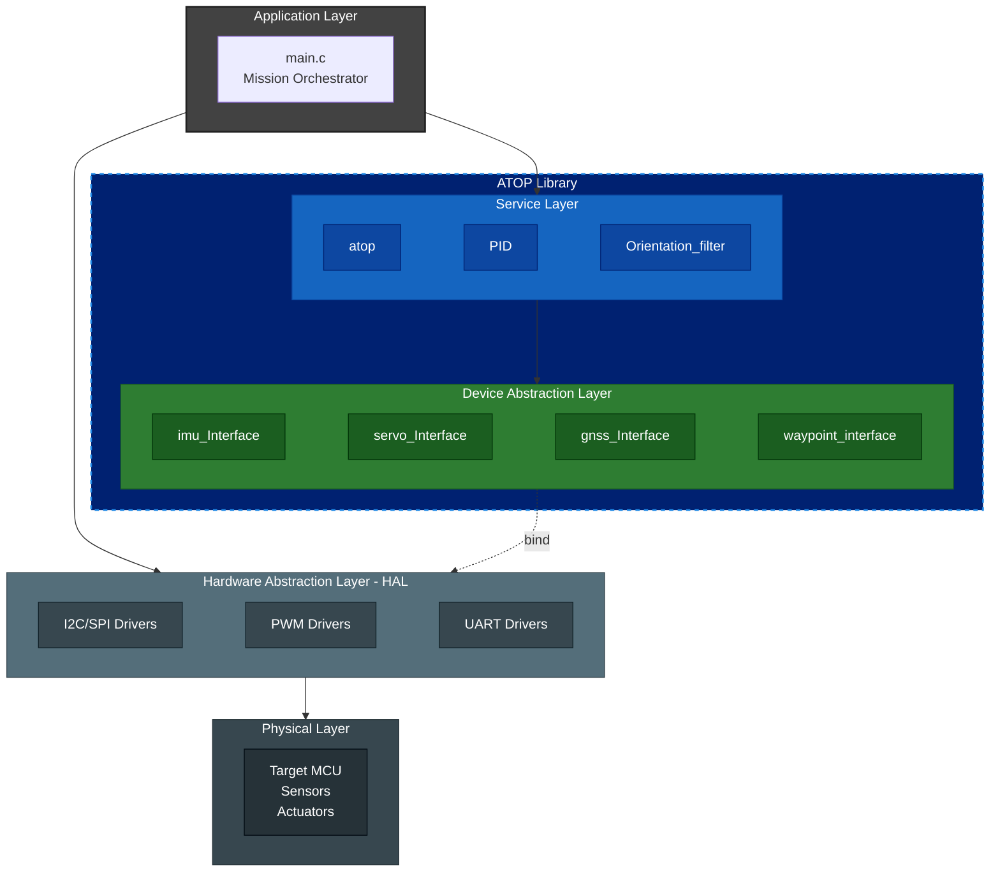

## System Architecture: ATOP 

### 1. Architectural Overview

The ATOP (Advanced Technology Operations Platform) library is designed following a strictly decoupled layered architecture. This ensures high reliability and hardware agnosticism, critical for long-term space missions where hardware components might be replaced or upgraded between mission phases.

### 2. Design Philosophy

- **Separation of Concerns:** The Service Layer possesses no knowledge of the underlying hardware; it only operates on standardized data structures.
- **Static Memory Allocation:** To ensure mission safety, the library avoids dynamic memory allocation (malloc), preventing heap fragmentation in long-running flight software.

### 3. Layer Definitions

*The dashed 'bind' line represents the functional dependency injection. This decoupled interface ensures that the flight-critical logic (ATOP Library) remains bit-identical across different hardware targets and simulation environments.*

#### 3.1 Application Layer

The Mission Orchestrator (main.c). It is responsible for:

- Initializing the Hardware Abstraction Layer (HAL).
- Injecting hardware-specific drivers into the ATOP Interfaces (Binding).
- Managing the high-level mission state machine.

#### 3.2 Service Layer (Core ATOP)

The "brain" of the system. It processes raw data into actionable knowledge:
- **Orientation Filter:** Implementation of the Madgwick/Mahony algorithms.
- **PID Controller:** Precision closed-loop control for actuators.
- **Quaternion Engine:** Mathematical utilities for 3D rotations.

#### 3.3 Device Abstraction Layer (DAL)
A set of Interface Contracts. It defines the "what" but not the "how".

Example: imu_interface expects a standardized acceleration vector, regardless of whether the physical sensor is an MPU6050 or a high-grade radiation-hardened IMU.

#### 3.4 Hardware Abstraction Layer (HAL)
The bridge between software and silicon. These are the specific drivers provided by the user or the MCU manufacturer (e.g., STM32 HAL, ESP-IDF, or bare-metal registers).

### 4. Integration  (Binding Process)
To maintain the decoupling shown in the diagram, the user must perform a Functional Binding at startup
