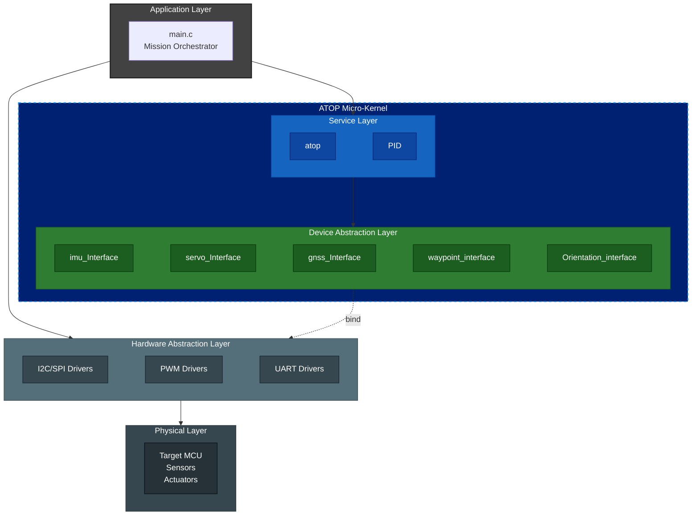
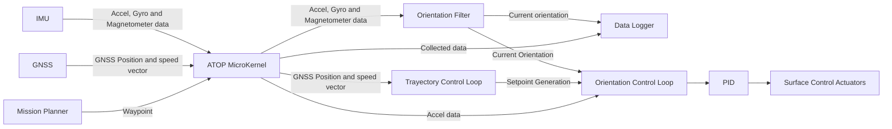
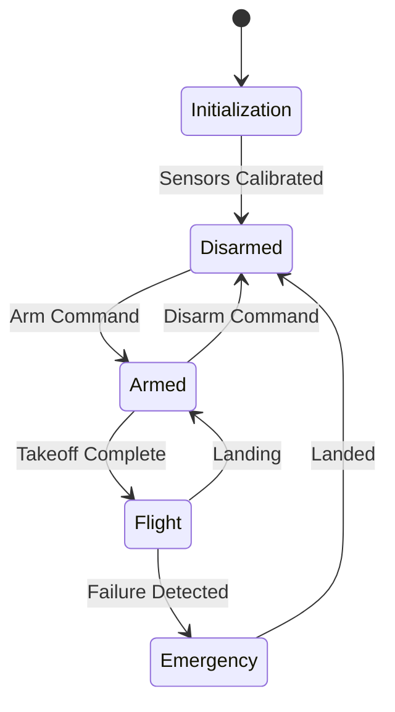

## System Architecture: ATOP 

### 1. Architectural Overview

The ATOP (Aeronautic Trajectory and Orientation Processor) Micro-kernel is designed following a strictly decoupled layered architecture. This ensures high reliability and hardware agnosticism, critical for long-term space missions where hardware components might be replaced or upgraded between mission phases.

### 2. Design Philosophy

- **Separation of Concerns:** The Service Layer possesses no knowledge of the underlying hardware; it only operates on standardized data structures.
- **Static Memory Allocation:** To ensure mission safety, the library avoids dynamic memory allocation (malloc), preventing heap fragmentation in long-running flight software.

### 3. Layer Definitions

```mermaid
graph TD
    subgraph Application_Layer [Application Layer]
        A[main.c <br/> Mission Orchestrator]
    end

    subgraph ATOP_microKernel [ATOP Micro-Kernel]
        subgraph Service_Layer [Service Layer]
            direction LR
            B1[atop] ~~~ B2[PID]
        end
        subgraph Device_Abstraction_Layer [Device Abstraction Layer]
            direction LR
            C1[imu_Interface] ~~~ C2[servo_Interface] ~~~ C3[gnss_Interface] ~~~ C4[waypoint_interface] ~~~ C5[Orientation_interface] 
        end
    end

    subgraph HAL_Layer [Hardware Abstraction Layer]
        direction LR
        D1[I2C/SPI Drivers] ~~~ D2[PWM Drivers] ~~~ D3[UART Drivers]
    end

    subgraph Physical_Layer [Physical Layer]
        E[Target MCU <br/> Sensors <br/> Actuators]
    end

    %% --- LOGICAL CONNECTIONS (Node-to-Node) ---

    %% Mission Flow: App uses Library Services
    Application_Layer --> Service_Layer
    
    %% Internal Coupling: Services use Abstraction Interfaces
    Service_Layer ---> Device_Abstraction_Layer
    
    %% Hardware Configuration: App initializes Drivers
    Application_Layer --> HAL_Layer
    
    %% Silicon Execution: Drivers interact with MCU
    HAL_Layer --> Physical_Layer

    %% Interface Binding: User links Interfaces with real HAL Drivers
    Device_Abstraction_Layer -. "bind" .-> HAL_Layer

    %% Services (Deep Blue)
    style B1 fill:#0D47A1,stroke:#002171,color:#fff
    style B2 fill:#0D47A1,stroke:#002171,color:#fff

    %% Interf. (Deep Green)
    style C1 fill:#1B5E20,stroke:#003308,color:#fff
    style C2 fill:#1B5E20,stroke:#003308,color:#fff
    style C3 fill:#1B5E20,stroke:#003308,color:#fff
    style C4 fill:#1B5E20,stroke:#003308,color:#fff
    style C5 fill:#1B5E20,stroke:#003308,color:#fff

    %% Hardware/HAL: Steel Grey
    style D1 fill:#37474F,stroke:#102027,color:#fff
    style D2 fill:#37474F,stroke:#102027,color:#fff
    style D3 fill:#37474F,stroke:#102027,color:#fff
    style E fill:#263238,stroke:#000a12,color:#fff

    %% --- LAYER STYLES ---
    style Application_Layer fill:#424242,stroke:#212121,stroke-width:2px,color:#fff
    style ATOP_microKernel fill:#002171,stroke:#1E88E5,stroke-width:2px,stroke-dasharray: 5 5,color:#fff
    style Service_Layer fill:#1565C0,stroke:#0D47A1,stroke-width:1px,color:#fff
    style Device_Abstraction_Layer fill:#2E7D32,stroke:#1B5E20,stroke-width:1px,color:#fff
    style HAL_Layer fill:#546E7A,stroke:#37474F,stroke-width:1px,color:#fff
    style Physical_Layer fill:#37474F,stroke:#263238,stroke-width:1px,color:#fff
```
*The dashed 'bind' line represents the functional dependency injection. This decoupled interface ensures that the flight-critical logic (ATOP Micro-kernel) remains bit-identical across different hardware targets and simulation environments.*

#### 3.1 Data Flow Diagram (DFD)

##### 3.1.1 Data Flow Diagram (DFD) - Level 0 (Context)

```mermaid
graph LR
    A[IMU] --> |Accel, Gyro and Magnetometer data| B[ATOP MicroKernel]
    C[GNSS] --> |GNSS Position and speed vector| B
    B --> |Accel, Gyro and Magnetometer data| D[Orientation Filter]
    D --> |Current orientation| E[Data Logger]
    D --> |Current Orientation| G[Orientation Control Loop]
    G --> H[PID]
    H --> F[Surface Control Actuators]   
    B --> |GNSS Position and speed vector| I[Trayectory Control Loop]
    I --> |Setpoint Generation| G
    J[Mission Planner] --> |Waypoint| B
    B --> |Accel data| G
    B --> |Collected data| E
```

##### 3.1.2 Data Flow Diagram (DFD) - Dependency Injection Flow

```mermaid
graph LR
    A[User HAL/DAL] -->|Function Pointers Dependancy Injection| B[MicroKernel Configuration]
    B --> C[ATOP MicroKernel]   
```

#### 3.2 Application Layer

The Mission Orchestrator (main.c). It is responsible for:

- Initializing the Hardware Abstraction Layer (HAL).
- Injecting hardware-specific drivers into the ATOP Interfaces (Binding).
- Managing the high-level mission state machine.

#### 3.3 Service Layer (Core ATOP)

The "brain" of the system. It processes raw data into actionable knowledge:
- **Orientation Filter:** Implementation of the Madgwick/Mahony algorithms.
- **PID Controller:** Precision closed-loop control for actuators.
- **Quaternion Engine:** Mathematical used for 3D rotations.

#### 3.4 Device Abstraction Layer (DAL)
A set of Interface Contracts. It defines the "what" but not the "how".

Example: imu_interface expects a standardized acceleration values, regardless of whether the physical sensor is an MPU6050 or a high-grade radiation-hardened IMU.

#### 3.5 Hardware Abstraction Layer (HAL)
The bridge between software and silicon. These are the specific drivers provided by the user or the MCU manufacturer (e.g., STM32 HAL, ESP-IDF, or bare-metal registers).

### 4. Execution Model (BetterOS)

The ATOP micro-kernel runs on **BetterOS** *(Bare-Metal Executive *ime-Triggered Efficient Runtime Operative System)*. Unlike conventional kernel designs, BetterOS is a strictly deterministic executive environment that implements a **Time-Triggered Execution (TTE)** model based on a **hybrid design of Non-Maskable Interrupts (NMI) and Sequential Function Chart (SFC).**

#### 4.1 Task Scheduling
BetterOS operates without a dynamic scheduler or heap-based management, using hardware timers to orchestrate execution through fixed temporal slots. BetterOS uses dedicated hardware timers to set status flags. The Main Loop continuously polls these flags to trigger the execution of specific SFC cycles.

| Task                  | Frequency | Execution Mode  |Trigger (Timer-Flag) | Description                     |
|-----------------------|-----------|-----------------|---------------------|---------------------------------|
| `orientation_task`    | 400 Hz    | Asynchronous    | NMI Timer           | AHRS, sensor fusion             |
| `mission_task`        | 10 Hz     | Synchronous Scan| TMR_MISSION_FLAG    | Master SFC: Phase Management    |
| `trajectory_task`     | 5 Hz      | Synchronous Scan| TMR_TRAJ_FLAG       | Waypoint tracking, setpoint gen |
| `health_check_task`   | 1 Hz      | Synchronous Scan| TMR_HEALTH_FLAG     | System monitoring               |
| `logger_task`         | 100 Hz    | Synchronous Scan| TMR_LOGGER_TASK     | Raw & processed data logging    |

#### 4.2 Control Cycle Architecture
BetterOS partitions execution into two distinct timing domains to guarantee stability:

1. **Critical Priority Domain (NMI):** The orientation_task is triggered directly by a non-maskable hardware interrupt of the highest priority. Its execution is immediate and preempts any other processor instruction, ensuring sensor fusion and PID stability occur within the exact microsecond required.
2. **SFC/Grafcet Execution:** Following a **PLC-style scan,** all mission logic is processed in a single synchronous block divided into three internal steps:
    1. **Input Reading:** Capture of DAL interfaces and timer flags to create a stable process image.
    2. **RS Table Processing:** Simultaneous execution of all Grafcet structures. The system processes a consolidated **RS (Set/Reset) Table** relative to all Grafcets, ensuring that stage transitions occur correctly and synchronously across all branches according to the **MEIA Methodology.**
    3. **Output Update:** Commitment of the logic results to actuators or internal command buffers.

#### 4.3 Data Integrity & Inter-Task Communication
To maintain strict decoupling between the **Asynchronous Domain (NMI)** and the **Synchronous Domain (SFC Scan)** without using blocking primitives, BetterOS implements a **Double-Buffering mechanism** for setpoint distribution:
* **Setpoint Exchange:** The `trajectory_task` (Producer) and `orientation_task` (Consumer) share a synchronized structure consisting of a **Selection Flag** and two setpoint variables.
* **Atomic Switching:**
    * The `trajectory_task` updates the setpoint only in the inactive buffer. Once the write is complete, it **toggles the Selection Flag in a single atomic operation.**
    * The `orientation_task` **(NMI)** always reads from the buffer indicated by the flag, ensuring it never accesses a partially written setpoint, even if the NMI preempts the main loop during a scan.
* **Zero-Interference:** This lock-free approach ensures the `orientation_task` maintains its 400 Hz hard real-time guarantee while the `trajectory_task` operates at its native 5 Hz cycle.

#### 4.4 Memory and State Management
* **Static Allocation:** BetterOS enforces a zero-heap policy. All task states, RS tables, and Grafcet stages are pre-allocated in static memory at compile-time.
* **Determinism:** The use of the RS table prevents transient states or race conditions, providing a mathematically sound execution of the flight mission.
* **Residual Use:** BetterOS ensures that even if a scan (e.g., logger_task) is executing, the orientation_task (NMI) will immediately preempt the CPU, maintain the 400 Hz cadence, and return control to the scan exactly where it left off.

### 5. System State Model (State Machine)

The system operates according to a finite state machine (FSM) that defines its main operational modes and safe transitions between them. This model ensures robust control during flight and handling of critical events such as failures or manual intervention.

```mermaid
stateDiagram-v2
    [*] --> Initialization
    Initialization --> Disarmed : Sensors Calibrated
    Disarmed --> Armed : Arm Command
    Armed --> Flight : Takeoff Complete
    Flight --> Armed : Landing
    Armed --> Disarmed : Disarm Command
    Flight --> Emergency : Failure Detected
    Emergency --> Disarmed : Landed   
```

### 6. Integration  (Binding Process)
To maintain the decoupling shown in the diagram, the user must perform a Functional Binding at startup
